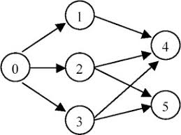

## 127. Topological Sorting

#### Question
Given an directed graph, a topological order of the graph nodes is defined as follow:

For each directed edge A -> B in graph, A must before B in the order list.
The first node in the order can be any node in the graph with no nodes direct to it.
Find any topological order for the given graph.


**Example 1**
<pre>
<b>Input:</b> For graph as follow:

<b>Output:</b> 
The topological order can be:
[0, 1, 2, 3, 4, 5]
[0, 2, 3, 1, 5, 4]
...
</pre>

#### Solution
##### Approach #1

```java
/**
 * Definition for Directed graph.
 * class DirectedGraphNode {
 *     int label;
 *     ArrayList<DirectedGraphNode> neighbors;
 *     DirectedGraphNode(int x) { label = x; neighbors = new ArrayList<DirectedGraphNode>(); }
 * };
 */

public class Solution {
    /*
     * @param graph: A list of Directed graph node
     * @return: Any topological order for the given graph.
     */
    public ArrayList<DirectedGraphNode> topSort(ArrayList<DirectedGraphNode> graph) {
        // write your code here
        ArrayList<DirectedGraphNode> ans = new ArrayList<>();
        if(graph == null || graph.size() == 0) return ans;
        
        Map<DirectedGraphNode, Integer> indegree = getIndegree(graph);
        /*
        for(DirectedGraphNode n : indegree.keySet()){
            System.out.print(n.label);
            System.out.print(":");
            System.out.println(indegree.get(n));
        }
        */
        Queue<DirectedGraphNode> queue = new LinkedList<>();
        
        for(DirectedGraphNode n : graph){
            if(indegree.get(n) == 0){
                queue.offer(n);
                ans.add(n);
            }
        }
        
        while(!queue.isEmpty()){
            DirectedGraphNode curr = queue.poll();
            for(DirectedGraphNode n : curr.neighbors){
                indegree.put(n, indegree.get(n) - 1);
                if(indegree.get(n) == 0){
                    queue.offer(n);
                    ans.add(n);
                }
            }
        }
        return ans;
    }
    
    private Map<DirectedGraphNode, Integer> getIndegree(ArrayList<DirectedGraphNode> graph){
        Map<DirectedGraphNode, Integer> ans = new HashMap<>();
        for(DirectedGraphNode node : graph){
            ans.put(node,0);
        }
        for(DirectedGraphNode node : graph){
            for(DirectedGraphNode n : node.neighbors){
               ans.put(n,ans.get(n) + 1);
            }
        }
        return ans;
    }
}
```
##### Complexity

* Time complexity: $O()$
* Space complexity: $O()$